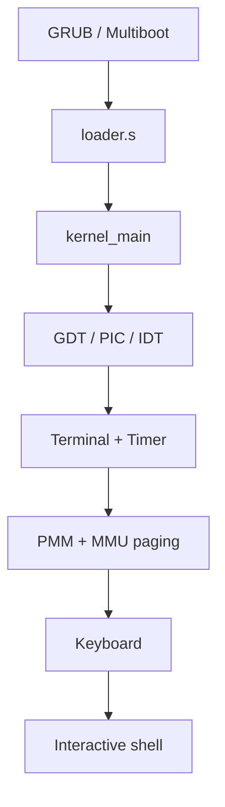

AuriOS is a 32-bit monolithic kernel, booted via **Multiboot** (GRUB), running
in protected mode on x86.

## Boot overview

On startup, GRUB loads the kernel via Multiboot and hands execution to
`loader.s`, which calls `kernel_main`. The kernel then sets up the CPU tables
(GDT, PIC remapping, IDT), initializes the terminal and the timer, then enables
interrupts. It next configures memory (PMM then MMU paging), initializes the
keyboard and hands control to the interactive shell.

## CPU components

- **GDT** (_Global Descriptor Table_) — defines the memory segments
  (`src/cpu/gdt.c`).
- **IDT** (_Interrupt Descriptor Table_) — table of interrupt vectors, with the
  service routines (ISR) and the IRQ handlers.
- **PIC** — the programmable interrupt controller is _remapped_ to avoid
  conflicts with CPU exceptions.

## Memory management

1. **PMM** (_Physical Memory Manager_) — tracks free / used physical pages via a
   _bitmap_, initialized from the memory map provided by the Multiboot
   bootloader.
2. **MMU / Paging** — enables hardware paging; a _page fault_ on an unmapped
   region is blocked (testable with the `mia` command).
3. **Kernel heap** — `malloc` / `free` provide dynamic allocation
   (`src/lib/malloc.c`).

## Drivers

- **Keyboard** — reads scancodes via IRQ1 (`src/drivers/keyboard.c`).
- **Timer (PIT)** — configured at 1000 Hz, provides `get_tick()` and `sleep()`.
- **Serial** — log output on the serial port (useful in `iso-debug`).
- **Framebuffer / terminal** — VGA text display with colors and ANSI escape
  sequences.

## Logging

The kernel exposes logging macros (`KINFO`, `KPANIC`) defined in
`src/include/log.h`. In `AURI_TEST_MODE`, output is redirected to the serial
port.
